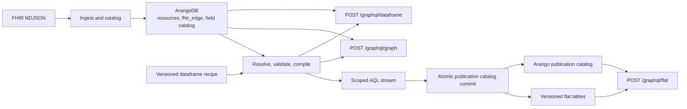

# Loom

Loom turns FHIR-shaped data in ArangoDB into authorized, queryable flat
dataframes in ClickHouse.

ArangoDB is the canonical graph store: Loom loads NDJSON, extracts FHIR
resources and relationships, profiles the populated graph, and compiles typed
dataframe recipes into scoped AQL. ClickHouse is the publication store: Loom
streams resolved recipe outputs into versioned physical tables, records their
schema and visibility in an Arango-backed catalog, and exposes them through a
stable reader API.

Loom is deliberately not an arbitrary AQL gateway, ClickHouse SQL proxy, or a
replacement FHIR model. It is a recipe-driven graph-to-flat data service with
explicit authorization and publication boundaries.



## What Loom owns

- FHIR NDJSON ingestion into ArangoDB resource collections and `fhir_edge`.
- Immutable dataset generations and active-generation selection.
- Populated-field, reference, traversal, and pivot discovery.
- Strict, versioned dataframe recipes and compiler-backed AQL execution.
- Scoped publication of recipe outputs into ClickHouse.
- A durable Arango catalog that maps logical dataframe names to current READY
  ClickHouse outputs.
- Multi-project, `auth_resource_path`-scoped flat-data reads.

Loom does **not** expose arbitrary ClickHouse tables, arbitrary SQL, or an
Elasticsearch/Guppy fallback. A logical `dataType` is a catalog alias, never a
browser-supplied physical table name.

## Runtime surfaces

| Surface | Purpose |
| --- | --- |
| `arango-fhir-proto` | Operator CLI for loading data, loading immutable generations, catalog discovery, and local dataframe materialization. |
| `arango-fhir-server` | HTTP server for graph compilation/control and flat dataframe reads. |
| `POST /graphql/graph` | Arango graph and recipe control plane: explicit graph traversal, typed FHIR reads, builder introspection, recipe validation, preview, execution, and publication. |
| `POST /graphql/dataframe` | Arango-backed FHIR dataframe compiler and executor (`runFhirDataframe`). |
| `POST /graphql/flat` | ClickHouse reader: discover published datasets, fetch rows with filters/keyset cursors, and aggregate registered outputs. |
| `POST /api/v1/imports` | Legacy one-resource import compatibility path; disabled in dataset-generation mode. |
| `GET /api/v1/raw` | Stream project-scoped FHIR resources as raw NDJSON, optionally filtered by `resourceType` and `limit`. |
| `PUT /api/v1/raw` | Load mixed-resource FHIR NDJSON; Loom infers each row's `resourceType`. |

`GET /graphql/graph` serves GraphQL Playground for the graph API. `GET /apollo`
opens Apollo Sandbox pointed at `/graphql/graph`. There is intentionally no
`/graphql` compatibility route.

Raw NDJSON uses ordinary FHIR resources without a Loom-specific envelope:

```bash
curl -H 'Authorization: Bearer ...' \
  'http://127.0.0.1:8080/api/v1/raw?project=ARANGODB_PROTO&resourceType=Patient&limit=10'

curl -X PUT -H 'Authorization: Bearer ...' \
  -H 'Content-Type: application/x-ndjson' \
  --data-binary @mixed.ndjson \
  'http://127.0.0.1:8080/api/v1/raw?project=ARANGODB_PROTO&generation=restore-1'
```

`project` is required for reads. Writes default to the standalone `default`
project when omitted. Generation-mode servers require `generation` on writes;
mutable servers omit it. The normal read-scope and write-authorization
boundaries apply before Arango is accessed.

## Data lifecycle

1. Load FHIR NDJSON into ArangoDB. Loom creates resource collections,
   `fhir_edge`, and `fhir_field_catalog`.
2. For production snapshots, load an immutable dataset generation and let the
   active manifest select it for a project.
3. Resolve a registered recipe against the populated graph and caller scope.
4. Compile the resolved recipe to parameterized AQL and stream rows from
   ArangoDB.
5. Publish output streams to new ClickHouse physical tables. Loom injects the
   reserved `auth_resource_path` column, records schema/provenance in Arango,
   and atomically advances the logical publication pointer only once every
   output is READY.
6. Query the logical dataframe through `/graphql/flat`. The reader resolves
   authorized current outputs from the catalog; it never accepts a physical
   ClickHouse table name.

The configured ClickHouse database is created by the server during startup if
necessary. Publication creates its tables itself. No DDL or alias-management
HTTP endpoint is required. The ClickHouse account needs database creation plus
`CREATE`, `INSERT`, `SELECT`, and `DROP` privileges.

## Local development

The local Compose stack starts both ArangoDB and ClickHouse:

```bash
rtk docker compose -f experimental/docker-compose.yml up -d
make generate-fhir
make generate-graphql
make build
```

Load the bundled example data into a mutable local namespace:

```bash
./bin/arango-fhir-proto load \
  --url http://127.0.0.1:8529 \
  --database fhir_proto \
  --meta-dir META \
  --project ARANGODB_PROTO \
  --auth-resource-path EllrottLab-GDC_Data
```

For a production-shaped immutable snapshot, use `load-generation` instead. It
requires an opaque generation identifier and deliberately forbids truncation:

```bash
./bin/arango-fhir-proto load-generation \
  --url http://127.0.0.1:8529 \
  --database fhir_proto \
  --meta-dir META \
  --project ARANGODB_PROTO \
  --generation local-meta-1 \
  --auth-resource-path EllrottLab-GDC_Data
```

Start Loom locally with an unrestricted development principal:

```bash
./bin/arango-fhir-server \
  --listen :8080 \
  --no-auth \
  --url http://127.0.0.1:8529 \
  --database fhir_proto \
  --clickhouse-url clickhouse://127.0.0.1:9000 \
  --clickhouse-database loom \
  --dataframer-recipe /path/to/dataframer.json
```

Add `--dataset-generations` when reading the active immutable generation. That
mode disables the legacy one-file import endpoint.

Useful local URLs:

- [Graph Playground](http://127.0.0.1:8080/graphql/graph)
- [Apollo Sandbox](http://127.0.0.1:8080/apollo)
- FHIR dataframe: `http://127.0.0.1:8080/graphql/dataframe`
- Flat reader: `http://127.0.0.1:8080/graphql/flat`
- [Health check](http://127.0.0.1:8080/health)

Run the checked-in graph dataframe example after the server is up:

```bash
make dataframe-demo
```

See [the Quickstart](docs/QUICKSTART.md) for the complete local setup flow and
[the GraphQL API guide](docs/GRAPHQL_API.md) for copy-paste examples of the
graph/compiler and published flat-reader APIs.

## Graph and flat GraphQL contracts

The complete request, filter, pagination, authorization, and limitation
reference is maintained in [docs/GRAPHQL_API.md](docs/GRAPHQL_API.md). The
short sections below explain where each surface fits in the system.

### Graph: compile, inspect, and publish

`/graphql/graph` is where a caller asks Loom about the Arango graph or drives
recipe work. `/graphql/dataframe` is the dedicated Arango-backed FHIR
dataframe compiler endpoint. Both use the same authorized Arango backend and
compiler; the separate routes keep client defaults aligned with query intent.

Publication is intentionally a recipe-level operation: Loom must read the
authorized Arango graph, resolve the recipe against the selected generation,
and then write its output to ClickHouse. It is not a raw “insert rows” API.

### Typed FHIR reads

The same `/graphql/graph` endpoint also exposes generated, typed FHIR reads.
The 23 root fields are exactly `BodyStructure`, `Condition`,
`DiagnosticReport`, `DocumentReference`, `FamilyMemberHistory`, `Group`,
`ImagingStudy`, `Medication`, `MedicationAdministration`, `MedicationRequest`,
`MedicationStatement`, `Observation`, `Organization`, `Patient`,
`Practitioner`, `PractitionerRole`, `Procedure`, `ResearchStudy`,
`ResearchSubject`, `Specimen`, `Substance`, `SubstanceDefinition`, and `Task`.
Each field returns a list and accepts `project`, `filters: [FhirFilterInput!]`,
and a `limit` (default 25). Read-only callers are capped at 10,000 rows;
callers with write access to the selected project are uncapped. ID lookup is
an ordinary `id` filter; filters are ANDed using the existing Loom selector
semantics.

Every selectable property in the generated FHIR schema is available, including
primitive-extension fields such as `_birthDate`. `Reference.resource` performs
an authorized outbound lookup for relative, absolute, and versioned references;
reverse relationships are not exposed. Cursor pagination, arbitrary sorting,
recursive filter trees, and same-element sibling correlation are not supported
in this checkpoint. The endpoint is FHIR-shaped, but is not advertised as a
fully HL7-conformant GraphQL implementation.

### Flat: discover and read published dataframes

`/graphql/flat` is the stable ClickHouse reader. The schema is intentionally
small and data-driven:

```graphql
query ExplorerRows($input: DataframeRowsInput!) {
  dataframeRows(input: $input) {
    materialization { name revision rowCount columns { name logicalType } }
    columns
    rows
    totalCount
    pageInfo { hasNextPage endCursor }
  }
}
```

```json
{
  "input": {
    "dataType": "cases",
    "first": 100,
    "sort": { "column": "case_id" }
  }
}
```

The public reader input contains a logical `dataType`, not a project,
generation, materialization ID, or physical table. Loom derives the authorized
project set from the principal, finds each project’s current READY publication,
and federates compatible outputs. Rows remain permissive JSON; columns and
capabilities are discovered at runtime so a new publication does not require a
GraphQL regeneration or server restart.

## Authorization and tenancy

In production, Loom uses either basic authentication or Calypr/Fence-backed
authorization. Calypr mode resolves the caller’s allowed
`auth_resource_path` values and applies them to graph reads and published flat
reads. Publication injects `auth_resource_path` into every ClickHouse output;
the flat reader treats it as an authorization predicate, never as a
client-controlled filter.

Set `--no-auth` only for local development. It creates an explicit unrestricted
principal and must not be used in a deployment.

The server can be configured with YAML:

```yaml
server:
  listen: ":8080"
  backend: arango
  url: http://arangodb:8529
  database: fhir_proto
  dataset_generations: true
  clickhouse:
    enabled: true
    url: clickhouse://clickhouse:9000
    database: loom
  dataframer:
    recipe: /etc/loom/dataframer.json

auth:
  mode: calypr
```

Basic mode reads `LOOM_AUTH_BASIC_USERNAME` and `LOOM_AUTH_BASIC_PASSWORD` if
they are not supplied in the config file.

`server.dataframer.recipe` is required only when ClickHouse is enabled. Loom
reads and validates that recipe during startup; deployments can update it
without rebuilding the server image.

## Repository guide

| Path | Responsibility |
| --- | --- |
| [`cmd/`](cmd) | Operator CLI, server executable, and developer tools. |
| [`internal/ingest`](internal/ingest) | NDJSON loading, validation, graph extraction, and ingest lifecycle. |
| [`internal/dataset`](internal/dataset) | Immutable generation and active-manifest contracts. |
| [`internal/catalog`](internal/catalog) | Evidence of populated fields, references, and authorization paths. |
| [`internal/dataframe/compiler`](internal/dataframe/compiler) | Typed plan IR, lowering, optimization, and AQL rendering. |
| [`internal/dataframe/recipe`](internal/dataframe/recipe) | Recipe contract, validation, schema resolution, execution, and control services. |
| [`internal/dataframe/publication`](internal/dataframe/publication) | Backend-neutral bounded streaming publication contract. |
| [`internal/dataframe/materialization`](internal/dataframe/materialization) | ClickHouse table lifecycle, durable publication pointers, and federated reads. |
| [`internal/store/arango`](internal/store/arango) | ArangoDB boundary. |
| [`internal/store/clickhouse`](internal/store/clickhouse) | Typed ClickHouse driver boundary and DDL/DML. |
| [`graphqlapi`](graphqlapi) | Graph control-plane schema and resolvers. |
| [`graphqlapi/clickhouse`](graphqlapi/clickhouse) | Dedicated flat-reader GraphQL schema and resolvers. |

## Build, generation, and tests

```bash
make build                 # server and CLI binaries
make generate-fhir         # generated FHIR structs and schema metadata
make generate-graphql      # gqlgen bindings
make graphql-check         # GraphQL and dataframe checks
make test                  # full Go test suite
make conformance           # compiler conformance corpus
```

The generated FHIR metadata and GraphQL bindings are checked in. Regenerate
them when their inputs change; do not hand-edit generated files.
[`docs/CODE_GENERATION.md`](docs/CODE_GENERATION.md) explains every generated
directory, its source of truth, and the required regeneration order.

For a direct build and full verification:

```bash
go build .
go test ./...
```

## Further reading

- [Quickstart](docs/QUICKSTART.md)
- [Default dataframer recipe authoring guide](docs/DATAFRAMER_RECIPES.md)
- [GraphQL API guide](docs/GRAPHQL_API.md)
- [Developer architecture](docs/DEVELOPER_ARCHITECTURE.md)
- [ClickHouse reader contract and execution plan](docs/CLICKHOUSE_GRAPHQL_READER_EXECUTION_PLAN.md)
- [Explorer/Loom parity plan](docs/EXPLORER_LOOM_SLICE_PARITY_PLAN.md)
- [Experimental local stack](experimental/README.md)

The Helm chart lives in the separate `gen3-helm` repository under `helm/loom`.
