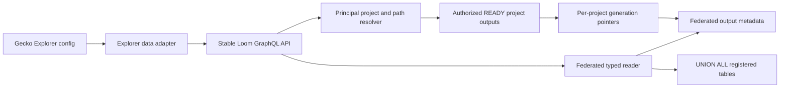

# ClickHouse GraphQL Reader Execution Plan

## Status and decision

This document defines the implementation plan for Loom's published-data read
surface. The selected architecture is a stable GraphQL control plane over a
dynamic ClickHouse data plane.

GraphQL will not generate one object type or query field per dataframe,
ClickHouse table, or column. Dataset and column metadata will instead be
discovered at runtime, while row and aggregate values will be returned through
the existing `JSON` scalar. Publishing a new dataframe output or adding a
column must not require regenerating GraphQL code or restarting Loom.

Every registered, READY Loom publication output is eligible for discovery and
query. Arbitrary ClickHouse tables that were not published and registered by
Loom are outside this API.

This is a ClickHouse-only publication and reader API. Loom does not expose an
Elasticsearch/OpenSearch publication target, reader implementation, fallback,
or backend selector. Guppy and Elasticsearch are legacy systems outside the
Loom runtime boundary. Migration is a hard deployment cutover after offline
parity validation, not a permanent dual-read or runtime-switch architecture.

### Current implementation status

The first Loom backend vertical slice implemented project/generation-scoped
outputs and logical aliases. The current reader revision exposes an
authorized multi-project federation for each `dataType`; public reader inputs
do not contain project or generation selectors. Columns and a federation
revision are discovered from publication metadata, and GraphQL exposes
dataset, row, count, filter, sort, cursor, and aggregate reads. ClickHouse
filter and cursor values are driver-bound; query-controlled identifiers are
validated against the published schema. Elasticsearch publication and reader
code has been removed.

The frontend compatibility adapter, full facet/histogram parity, streaming
exports, real-ClickHouse integration fixtures, and deployment cutover evidence
remain Phase 6-8 work. A materialization-ID query remains only for internal
compatibility; the Explorer reader path is principal-scoped and `dataType`
based.

The Loom-owned implementation plan for facet parity, streaming exports, and
real-ClickHouse fixtures is tracked in
[`CLICKHOUSE_READER_COMPLETION_PLAN.md`](CLICKHOUSE_READER_COMPLETION_PLAN.md).

The detailed cross-repository execution plan for those remaining reader and
Explorer items is [EXPLORER_LOOM_SLICE_PARITY_PLAN.md](EXPLORER_LOOM_SLICE_PARITY_PLAN.md).

## Goals

- Read every registered Loom publication output through one stable GraphQL API.
- Discover new datasets and columns without a server restart or schema rebuild.
- Federate all current project outputs visible to the authenticated principal.
- Preserve project, per-project dataset-generation, and row authorization
  boundaries inside that federation.
- Support the Explorer capabilities currently supplied by Guppy:
  - schema and field discovery;
  - filtered and sorted rows;
  - total counts;
  - facet buckets and statistics;
  - stable pagination;
  - download-oriented streaming in a later transport-specific endpoint.
- Keep Gecko's current Explorer configuration shape during migration.
- Treat `guppyConfig.dataType` as a logical dataset alias rather than a physical
  legacy index or ClickHouse table name.
- Include canonical `auth_resource_path` in every published row.
- Return explicit column metadata alongside permissive JSON row values.
- Make publication commit the visibility boundary for readers.

## Non-goals

- Exposing arbitrary SQL or arbitrary ClickHouse tables through GraphQL.
- Recreating Guppy's dynamically generated GraphQL object types.
- Making a caller-supplied row filter an authorization boundary.
- Preserving Guppy's offset-pagination limit or legacy backend-specific query
  representation.
- Supporting a pluggable publication/read backend or Elasticsearch fallback.
- Requiring recipes or Gecko config to declare the reserved
  `auth_resource_path` system column manually.
- Moving Explorer configuration ownership out of Gecko in this work package.

## Architecture



The GraphQL schema describes operations and metadata envelopes. It does not
describe the columns of an individual dataframe. The dataset catalog resolves
one logical `dataType` to every authorized current READY project output, and
the reader only builds SQL from catalog-validated identifiers and supported
operators.

## Dataset identity and visibility

The physical publication identity is:

```text
project + dataset generation + dataset alias
```

The public logical identity is:

```text
authenticated principal + dataset alias
```

The catalog must retain the full publication identity:

```text
project
dataset generation
recipe name and digest
resolved schema digest
authorization scope mode and paths
reserved auth_resource_path column
output name
logical dataset alias
physical ClickHouse table
columns and ClickHouse types
row count
publication state and timestamps
```

`dataset alias` is the frontend-facing name, initially matching the existing
Explorer `guppyConfig.dataType` values such as `observation` or `file`. The alias
must be explicit publication metadata. The reader must not infer it by parsing
physical table names or applying ad hoc naming conventions.

The current bundle pointer is keyed only by bundle name. Replace this with a
canonical, collision-safe pointer key containing project, generation, and
dataset identity. Two projects publishing the same recipe or output name must
never advance each other's visible pointer.

Publication becomes visible only after all outputs are READY and the catalog
pointer advances atomically. Readers resolve the pointer once per operation and
never scan for the newest table by timestamp.

For public reads, Loom enumerates the principal's authorized projects, resolves
each project's active READY generation and alias pointer, reconciles their
schemas, and queries the resulting source set as one federation. The browser
does not provide a project boundary or project filter.

## GraphQL contract

The final names may be adjusted during schema review, but the operations and
separation of concerns are required.

```graphql
extend type Query {
  dataframeDatasets: [DataframeDataset!]!
  dataframeDataset(dataType: String!): DataframeDataset
  dataframeRows(input: DataframeRowsInput!): DataframeRowConnection!
  dataframeAggregate(input: DataframeAggregateInput!): DataframeAggregateResult!
}

type DataframeDataset {
  dataType: String!
  revision: String!
  columns: [DataframeColumn!]!
  rowCount: Int
}

type DataframeColumn {
  name: String!
  clickhouseType: String!
  logicalType: String!
  nullable: Boolean!
  repeated: Boolean!
  filterable: Boolean!
  sortable: Boolean!
  aggregatable: Boolean!
}

input DataframeRowsInput {
  dataType: String!
  columns: [String!]
  filters: DataframeFilterExpression
  sort: [DataframeSortInput!]
  first: Int = 100
  after: String
}

type DataframeRowConnection {
  dataset: DataframeDataset!
  columns: [DataframeColumn!]!
  rows: JSON!
  totalCount: Int
  pageInfo: DataframePageInfo!
}
```

The current materialization-ID and project-required operations may remain
temporarily for internal compatibility, but Explorer uses only `dataType`.
Physical IDs, project selectors, and table names must not appear in Gecko
configuration.

### Filter contract

Replace the flat `EQ`/`CONTAINS` list with a recursive expression tree:

```graphql
input DataframeFilterExpression {
  and: [DataframeFilterExpression!]
  or: [DataframeFilterExpression!]
  not: DataframeFilterExpression
  predicate: DataframeFilterPredicate
}

input DataframeFilterPredicate {
  column: String!
  op: DataframeFilterOperator!
  value: JSON
}

enum DataframeFilterOperator {
  EQ
  NEQ
  IN
  NOT_IN
  LT
  LTE
  GT
  GTE
  CONTAINS
  STARTS_WITH
  EXISTS
  IS_NULL
  ARRAY_CONTAINS
  ARRAY_OVERLAPS
}
```

Each operator must declare its valid logical and ClickHouse types. Unsupported
operator/type combinations fail validation before SQL execution. All values
must be passed as ClickHouse parameters; values may never be interpolated into
SQL text.

### Aggregation contract

The aggregate operation must cover the Explorer use cases without copying
Guppy's nested GraphQL response shape into the canonical reader:

- exact total count;
- value count and distinct count;
- terms/facet buckets with missing count and configurable limit;
- numeric/date histogram;
- minimum, maximum, sum, average, and basic statistics;
- optional group-by columns;
- the same filter-expression contract used by row reads;
- `filterSelf` behavior implemented by the frontend compatibility adapter.

Canonical aggregate results should be normalized rows plus typed column
metadata. The frontend adapter may reshape them into the current Guppy bucket
objects during migration.

## Runtime schema discovery

The publication catalog is the primary schema authority. A successful
publication already knows its output names and declared ClickHouse column
types, so reads should not require a `system.columns` lookup on every request.

ClickHouse introspection is a verification and recovery mechanism:

- verify a registered table and its declared columns during startup recovery;
- diagnose catalog/table drift;
- rebuild missing derived column capabilities when explicitly requested;
- never discover and expose an unregistered physical table automatically.

Dataset metadata may be cached by logical identity. Cache entries must be
invalidated when the corresponding publication pointer advances. A short TTL
is a fallback, not the primary freshness mechanism. New publications must be
readable immediately without restart.

## ClickHouse type policy

The first implementation must define and test a capability matrix rather than
silently coercing every value to a string.

Initial required families:

- signed and unsigned integers;
- floating-point values;
- boolean values;
- strings;
- `Date`, `Date32`, `DateTime`, and `DateTime64`;
- `Nullable(T)` for every supported scalar;
- `Array(T)` for supported scalar elements.

Follow-up families may include Decimal, UUID, Enum, LowCardinality, Map,
Tuple, and ClickHouse JSON/Object types. Adding one of these types changes the
runtime codec and capability matrix, not the GraphQL schema.

Unknown registered types must remain visible in dataset metadata. Row reads
may return them when the ClickHouse JSON projection can encode them safely;
otherwise the API returns an explicit unsupported-type error naming the column
and type. A new type must never require a Loom restart after its codec is
already present in the running version.

## Authorization and tenant boundaries

Authorization has two distinct layers:

1. Source selection: derive the authorized project set from the principal,
   resolve each project's active generation, and include only current READY
   outputs for the requested `dataType`.
2. Row scope: apply a server-derived `auth_resource_path` predicate inside
   every project union branch for restricted principals.

A caller-supplied `auth_resource_path` filter may narrow a query, but is not an
authorization check. Physical table names, catalog lookups, dataset listings,
and error messages must not reveal unauthorized projects or outputs.

The alias resolver performs an authorized `dataType -> project outputs` lookup.
There is no unauthenticated global alias-to-table lookup, and browser filters
cannot add a project or auth path to the source set.

## Package ownership

The implementation should preserve the current dataframe package boundaries:

| Responsibility | Owner |
| --- | --- |
| Publication identity, output records, and pointer semantics | `internal/dataframe/materialization` |
| Arango-backed publication catalog | `internal/dataframe/materialization/arango` |
| Logical dataset alias resolution | new cohesive package under `internal/dataframe/materialization` |
| Safe ClickHouse row and aggregate query construction | `internal/dataframe/materialization` |
| ClickHouse execution and JSON decoding | `internal/store/clickhouse` |
| GraphQL authorization and transport mapping | `internal/api/graphql/graph/materialization` |
| GraphQL schema and resolvers | `internal/api/graphql/graph` |
| Guppy response compatibility | frontend data adapter, not canonical Loom reader |

Do not add Explorer configuration parsing to the compiler. The compiler owns
dataframe meaning and publication; the reader resolves already-published
outputs. Gecko remains the configuration owner.

## Execution phases

### Phase 1: Contract and parity fixtures

1. Inventory the legacy Guppy operations used by Explorer and reports.
2. Capture representative requests and normalized expected results for rows,
   filters, sorting, counts, terms facets, numeric facets, details panels, and
   downloads.
3. Define the canonical Loom filter, sort, aggregate, error, and pagination
   contracts.
4. Decide the initial ClickHouse type capability matrix.

Exit criteria:

- Every required frontend behavior maps to a canonical Loom operation or an
  explicitly deferred compatibility item.
- Contract tests exist independently of a running ClickHouse instance.

### Phase 2: Unify publication and read metadata

1. Remove the split between legacy `Materialization` records used by the reader
   and `BundleExecution`/`BundleOutputRecord` records used by publication.
2. Make each READY bundle output directly resolvable as a published dataset.
3. Add explicit dataset aliases to publication metadata.
4. Namespace pointers by project, generation, and dataset identity.
5. Inject the reserved `auth_resource_path` column into every published
   output. Keep project identity in publication/catalog metadata, not rows.
6. Add catalog operations to resolve every authorized current READY project
   output for one alias.
7. Add schema reconciliation and a federation revision over the source set.
8. Add migration/recovery handling for existing records where practical.

Exit criteria:

- Publishing a bundle makes every output readable through the same catalog
  transaction without writing a parallel registry record.
- Identical recipe/output names in different projects cannot collide.
- Failed or superseded outputs are not reader-visible.
- One public alias resolves to all and only principal-authorized project
  outputs.

### Phase 3: Canonical typed reader

1. Replace materialization-ID and project-required lookup with
   principal-scoped `dataType` federation at the public service boundary.
2. Validate selected columns, filters, sort columns, and aggregate columns
   against registered metadata.
3. Introduce parameterized ClickHouse predicates for the filter expression.
4. Support deterministic multi-column keyset pagination with an internal row
   identity and project/source tie-breaker.
5. Return runtime column metadata and JSON rows.
6. Add exact count support without coupling it to every row request when the
   caller does not need it.
7. Add configurable page, query-complexity, bucket, and execution-time limits.

Exit criteria:

- No query-controlled identifier or value reaches SQL without catalog
  validation or parameter binding.
- Pagination neither duplicates nor skips rows across equal sort values.
- Reads work for every type in the initial capability matrix.

### Phase 4: Discovery and aggregations

1. Add dataset listing and single-dataset schema discovery.
2. Derive filterable, sortable, and aggregatable capabilities per column.
3. Implement total count, terms facets, missing values, statistics, and
   numeric/date histograms.
4. Add publication-driven cache invalidation.
5. Add catalog/table drift diagnostics and startup recovery checks.

Exit criteria:

- A newly published dataset and its columns are discoverable immediately.
- Explorer's mapping and facet requirements no longer depend on Guppy.
- Aggregate limits prevent unbounded cardinality responses.

### Phase 5: GraphQL transport

1. Add the stable dataset, rows, and aggregate inputs and result envelopes to
   `internal/api/graphql/graph/schema/schema.graphqls`.
2. Regenerate gqlgen output; do not edit generated files manually.
3. Add transport adapters in `internal/api/graphql/graph/materialization`.
4. Normalize authorization failures and validation errors into stable GraphQL
   error codes.
5. Keep legacy materialization-ID operations only while an internal caller
   still needs them, then remove them.

Exit criteria:

- Publishing a new dataset or column requires no GraphQL regeneration or Loom
  restart.
- GraphQL introspection remains stable while runtime dataset introspection
  reflects current publications.

### Phase 6: Explorer compatibility adapter

1. Add the Loom reader API client that replaces the current Guppy client in the
   frontend.
2. Translate existing `guppyConfig.dataType`, table fields, filters, charts,
   field mappings, and shared-filter configuration into canonical Loom calls.
3. Preserve Gecko's current Explorer configuration JSON.
4. Maintain cursor state per table page while preserving the current UI.
5. Reshape canonical aggregate results into the structures expected by current
   facets and charts.
6. Leave manifest/download behavior on its existing path until the streaming
   export endpoint is implemented and verified.

Exit criteria:

- One Explorer tab reads from Loom without changing its Gecko config document.
- Rows, counts, filters, sorting, facets, and details-panel lookup are equivalent
  for the selected dataset.

### Phase 7: Streaming export

1. Add an authorized HTTP streaming endpoint for CSV, TSV, JSON Lines, and
   manifest-oriented exports.
2. Reuse the canonical dataset resolver and filter contract.
3. Stream ClickHouse results without loading the complete export into memory.
4. Apply export-specific row, byte, concurrency, timeout, and audit controls.

GraphQL initiates or describes exports but does not carry large files.

Exit criteria:

- Large downloads use Loom's ClickHouse streaming path.
- Export authorization and row selection match interactive reads.

### Phase 8: Parity handoff for user-managed cutover

1. Before deployment, run offline parity fixtures comparing captured legacy
   results with Loom/ClickHouse results for every configured Explorer dataset.
2. Compare schemas, row identities, counts, sorted pages, filter results,
   facets, details reads, and downloads.
3. Require every configured alias to resolve at least one authorized READY
   project output and verify multi-project union behavior.
4. Produce latency, ClickHouse query-cost, error-rate, and authorization
   evidence for the user-managed deployment cutover.

Deployment timing and rollback are outside this implementation plan.

## Test matrix

Required automated coverage includes:

- catalog resolution across projects, generations, aliases, and pointer
  advancement;
- unauthorized dataset non-disclosure;
- restricted and unrestricted authorization scopes;
- every supported scalar, nullable, and array type;
- null, empty-array, unicode, date/time, and numeric-boundary values;
- every filter operator with valid and invalid type combinations;
- compound `AND`, `OR`, and `NOT` expressions;
- stable ascending and descending cursor pagination with duplicate and null sort
  values;
- aggregate correctness, missing buckets, high-cardinality limits, and
  `filterSelf` adapter behavior;
- publication/read concurrency and pointer swaps;
- stale catalog records and missing ClickHouse tables;
- SQL-injection attempts through identifiers, operators, cursors, and values;
- GraphQL complexity/page/bucket limits;
- captured legacy-result-versus-Loom parity fixtures for the initial Explorer
  datasets; these fixtures must not require a live legacy backend.

Integration coverage must run against a real ClickHouse instance. Unit tests
that only assert generated SQL are necessary but insufficient.

## Operational requirements

- Structured logs include project, generation, dataset alias, execution/output
  ID, selected column count, filter complexity, rows returned, duration, and a
  query digest. Logs must not include unrestricted row values.
- Metrics cover resolution failures, authorization denials, query latency,
  scanned/read rows when available, result rows, aggregate bucket counts,
  cache hits, ClickHouse errors, and publication-to-discovery delay.
- Reader limits are configurable and have conservative defaults.
- Health checks distinguish GraphQL availability, catalog availability, and
  ClickHouse read readiness.
- Pointer advancement and rollback are auditable.

## Definition of done

The work is complete when:

- every authorized READY registered Loom output participates in its logical
  `dataType` federation without a browser-supplied project;
- every published row carries canonical `auth_resource_path`;
- arbitrary unregistered ClickHouse tables are not exposed;
- new datasets and columns require neither GraphQL regeneration nor restart;
- Explorer runs its table, filters, counts, facets, charts, and details reads
  against Loom while retaining its Gecko configuration shape;
- authorization is enforced before physical dataset resolution and remains
  generation-aligned;
- the initial ClickHouse type matrix passes unit and real integration tests;
- large exports have a bounded streaming path;
- offline parity evidence is ready for the user-managed migration from the
  legacy read stack to Loom/ClickHouse.
