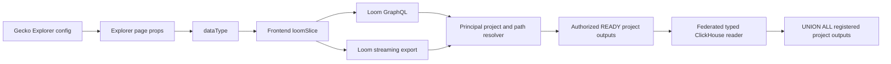

# Explorer Loom Slice and Read API Parity Plan

## Status

This is the cross-repository execution plan for replacing the Explorer's Guppy
read path with Loom and ClickHouse. It covers the previously identified parity
items 1, 2, 3, 4, 5, 7, 8, 9, 10, and 11.

Item 6, Guppy's caller-selected `accessibility` modes, is intentionally not
recreated. Loom authorizes each request from the authenticated principal,
project, generation, and publication scope. The browser must not choose an
authorization tier.

The implementation spans:

- Loom: `/Users/peterkor/Desktop/BMEG/loom`
- Frontend: `/Users/peterkor/Desktop/FFNEW/IDP-Frontend`
- Gecko config ownership: `/Users/peterkor/Desktop/BMEG/gecko`

The current frontend work branch is `feature/clickhouse-explorer`.

## Outcome

Explorer must retain its current Gecko configuration model and visible
behavior while all table, mapping, filter, sort, facet, details, and bulk
metadata reads move to Loom. Loom reads only registered READY ClickHouse
publication outputs. A read for one `dataType` federates every current project
output visible to the authenticated principal. Neither Loom nor the Explorer
adapter may fall back to Guppy or Elasticsearch at runtime.

`guppyConfig.dataType` remains the configured logical dataset alias during the
migration. The unfortunate property name can be renamed in a later config
migration; it must not force a simultaneous Gecko configuration rewrite now.

## Current contract gaps

The first Loom reader slice already provides dataset discovery, runtime column
metadata, flat filters, one-column keyset sorting, total counts, JSON rows, and
basic aggregate functions. The current Explorer depends on additional Guppy
behavior:

- `_mapping` for per-index and shared-field discovery;
- authorized federation of the same `dataType` across all visible projects;
- automatic `project` and `auth_resource_path` propagation into every
  published row;
- recursive filter trees;
- multiple sort columns and offset-oriented page controls;
- batched terms facets, missing counts, statistics, and nested aggregations;
- nested response shaping for dotted field paths;
- identifier-based details reads;
- bulk JSON, CSV, and TSV downloads;
- stable limits and error contracts;
- authorization-safe discovery that does not reveal inaccessible datasets.

## Assumptions and decisions

### A1. Explorer reads are authorized multi-project federations

Loom's server configuration remains projectless. The current YAML server
configuration already has no project setting; the project requirement to
remove is in the reader GraphQL inputs and project-scoped publication lookup.

Each panel supplies only `panel.guppyConfig.dataType`. Loom obtains the
authenticated principal's authorized projects, resolves the current READY
publication for that alias independently in each project, and queries their
ClickHouse outputs as one logical dataset.

`project` remains part of each physical publication identity and pointer. It is
not a browser input, filter, or returned dataframe field.

When projects have different active generation identifiers, each source uses
its own active READY generation. The federation response carries an opaque
revision derived from all selected project publication pointers so cursors and
caches cannot survive a partial source update incorrectly.

The boundary is deliberately asymmetric:

- server startup configuration has no project;
- every dataset-generation load requires its owning project;
- generated graph documents and edges carry `project` and
  `auth_resource_path`;
- every published dataframe row preserves `auth_resource_path`, while project
  remains publication/catalog metadata;
- public Explorer reads require `dataType`, not project.

Loom's ingest row builders already attach project and auth metadata to graph
records. The re-engineering work is to preserve `auth_resource_path` through
dataframe compilation/publication and use catalog project metadata to federate
sources safely at read time.

### A2. Scope is Explorer and CohortBuilder first

`loomSlice` initially replaces the Guppy operations used by Explorer and
CohortBuilder. The repository has other direct Guppy consumers, including the
GraphQL query editor and CohortDiscovery. Their deployment cutover is outside
this plan and will be handled separately. There will be no request-by-request
fallback inside `loomSlice`.

### A3. Gecko JSON remains recognizable

Existing panels, filters, tables, charts, `preFilters`, details configuration,
manifest mapping, and `guppyConfig.dataType` remain valid. No project or Loom
server context is added to Explorer configuration. Existing `fieldMapping`
remains a display-label mapping; it is not silently reinterpreted as a
physical ClickHouse column mapping.

### A4. Logical field paths and physical columns are separate

ClickHouse physical identifiers cannot safely reproduce every dotted Guppy
field path. Publication metadata must therefore distinguish a stable public
field path from the physical ClickHouse column name. Browsers send public paths
only. Loom resolves and validates the corresponding physical identifier.

Every published row contains reserved `auth_resource_path`. It is injected by
the dataframe publication pipeline from Loom's loaded graph metadata rather
than being repeated in every recipe. Recipes cannot override or remove it.
Project remains internal load, publication, and catalog source metadata; it is
not duplicated into dataframe rows or exposed as a public row field.

The frontend adapter reconstructs nested JSON objects from public dotted paths
for components that currently use JSONPath. Physical table and column names
never appear in Gecko config or frontend state.

### A5. Cursor pagination remains canonical

Loom keeps ClickHouse-natural keyset pagination. The frontend uses
previous/next navigation and maintains a cursor ledger keyed by dataset,
federation revision, filters, sort, and page size. Previously visited pages may
remain navigable from the ledger. Arbitrary jumps to an unvisited page and
offset compatibility are intentionally not implemented.

### A6. Authorization replaces `accessibility`

Frontend request types stop sending Guppy's `Accessibility` value to Loom.
Existing controls may remain visually hidden during the first cutover, then be
removed. Loom derives visibility exclusively from the authenticated principal
and registered publication scope.

### A7. Downloads are HTTP streams

GraphQL describes and queries interactive data. Large JSON, CSV, and TSV
downloads use an authenticated Loom HTTP endpoint so results stream from
ClickHouse without accumulating in GraphQL or browser memory.

### A8. Routing

The expected public service prefix is `${GEN3_API}/loom`, producing:

- GraphQL: `${GEN3_LOOM_API}/graphql/flat`
- health: `${GEN3_LOOM_API}/healthz`
- export: `${GEN3_LOOM_API}/api/v1/dataframe/export`

Recent routing work is assumed to provide this prefix. If the deployed
reverse-proxy prefix differs, only `GEN3_LOOM_API` and chart wiring change;
slice request shapes do not.

## Target request flow



## Federated read model

The catalog continues to store independent physical sources using:

```text
project + project-active-generation + dataType -> current READY output
```

The public reader resolves a logical dataset using:

```text
authenticated principal + dataType -> authorized current project outputs
```

Resolution follows this order:

1. Require an authenticated principal.
2. Resolve the principal's authorized project set and auth resource paths.
3. For each authorized project, resolve that project's active READY generation.
4. Resolve the current READY output for `dataType` within that project and
   generation.
5. Drop missing outputs without revealing them; fail only when no authorized
   source remains.
6. Build a federation revision from the sorted project, generation, and output
   pointer identities.
7. Reconcile the public schemas and compile one federated ClickHouse query.

The ClickHouse query uses `UNION ALL` over catalog-approved physical tables.
Every branch selects the same public column order and includes the reserved
`auth_resource_path` and internal global-row-key columns. Project identity may
contribute to an internal source key but is not projected as a public column.
Missing optional columns are emitted as typed NULL values. Incompatible types
produce an explicit schema-conflict error before query execution.

Authorization is applied twice by design:

- source authorization restricts the projects and outputs entering the union;
- row authorization adds a bound `auth_resource_path` predicate to every
  branch for restricted principals.

A browser-supplied `auth_resource_path` filter is applied only after these
server-derived restrictions. It can reduce results but cannot add paths.

Rows use a global tie-breaker derived from source project, publication output,
and `__loom_row_id`. Counts, facets, statistics, details, and exports operate
over the same authorized union rather than merging independently queried
results in the frontend.

### Publication scope policy

The current publication path can bind an output to the publishing caller's
`AuthResourcePaths`. That is unsuitable for a Guppy-like federated reader: it
would create partial, caller-shaped tables and make later readers depend on
which principal performed publication.

The reader target therefore requires one complete current output per:

```text
project + active generation + dataType
```

Publication runs under a trusted project-generation context, preserves each
row's `auth_resource_path`, and does not trim rows to an interactive caller's
read scope. `AuthResourcePaths` may remain as audit provenance during migration
but is not part of the public alias pointer or reader authorization decision.
Existing scope-trimmed outputs must be republished before they join a
federation.

If complete project publication cannot be authorized operationally, the
alternative is explicit non-overlapping scope shards registered under one
project output. That is more complex because Loom must prove shard completeness
and prevent duplicate rows; it is not the initial design.

### Federated schema policy

Dataset discovery returns the union of public fields across authorized
sources. Schema reconciliation is deterministic:

- identical types remain unchanged;
- integer families may promote to a common integer type;
- integer and floating-point mixtures promote to number;
- missing columns become nullable;
- scalar-versus-array and otherwise incompatible families are schema
  conflicts unless publication metadata declares a supported coercion;
- capabilities are the safe intersection across every source containing the
  field.

Publication recipes should normally keep a `dataType` schema stable across
projects. The reconciliation policy handles optional dynamic columns without
silently stringifying incompatible data.

## Canonical Loom contract changes

### Public column metadata

Extend published column metadata so the API can preserve Explorer field paths
without binding the config to ClickHouse identifiers:

```graphql
type DataframeColumn {
  name: String!          # stable public field path used by clients
  logicalType: String!
  nullable: Boolean!
  repeated: Boolean!
  filterable: Boolean!
  sortable: Boolean!
  aggregatable: Boolean!
  description: String
}
```

The physical ClickHouse name remains in internal publication metadata. If the
existing `name` must stay physical for migration, add `path` and make all new
inputs accept `path`; do not overload one value with both meanings.

Publication validation must reject duplicate public paths and missing physical
targets. Dataset aliases must explicitly match configured
`guppyConfig.dataType` values.

Dataset discovery becomes principal-scoped and federated:

```graphql
type DataframeDataset {
  dataType: String!
  revision: String!
  columns: [DataframeColumn!]!
  rowCount: Int
}

extend type Query {
  dataframeDatasets: [DataframeDataset!]!
  dataframeDataset(dataType: String!): DataframeDataset
}
```

`rowCount` is the authorized federated count when cheaply available; callers
use the row count operation otherwise. Project membership remains internal to
authorized federation resolution and is not part of this public contract.

### Recursive filter contract

Replace the public flat filter list with a recursive expression. Keep the old
input only until all internal callers migrate.

```graphql
enum DataframeFilterOperator {
  EQ
  NEQ
  IN
  NOT_IN
  LT
  LTE
  GT
  GTE
  CONTAINS
  STARTS_WITH
  EXISTS
  IS_NULL
  ARRAY_CONTAINS
  ARRAY_OVERLAPS
}

input DataframeFilterPredicateInput {
  column: String!
  op: DataframeFilterOperator!
  value: JSON
}

input DataframeFilterExpressionInput {
  and: [DataframeFilterExpressionInput!]
  or: [DataframeFilterExpressionInput!]
  not: DataframeFilterExpressionInput
  predicate: DataframeFilterPredicateInput
}
```

Exactly one of `and`, `or`, `not`, or `predicate` must be populated. Empty
groups are rejected except for an explicitly documented match-all root.
Operator and value types are validated against column capabilities before SQL
construction. Every value is driver-bound.

Frontend translation covers the existing `FilterSet` operations:

| Frontend operation | Loom operation |
| --- | --- |
| `and` | `and` |
| `or` | `or` |
| `=` | `EQ` |
| `!=` | `NEQ` |
| `in`, `includes` | `IN` or `ARRAY_OVERLAPS` from column metadata |
| `exclude` | `NOT_IN` |
| `excludeifany` | negated `ARRAY_OVERLAPS` |
| `<`, `<=`, `>`, `>=` | `LT`, `LTE`, `GT`, `GTE` |
| `exists` | `EXISTS` |
| `missing` | `IS_NULL` |
| `nested` | resolved public path plus nested child expression |

### Multi-column sort and cursor contract

Change row sort from one optional value to an ordered list:

```graphql
enum DataframeSortDirection { ASC DESC }
enum DataframeNullsOrder { FIRST LAST }

input DataframeSortInput {
  column: String!
  direction: DataframeSortDirection! = ASC
  nulls: DataframeNullsOrder! = LAST
}

input DataframeRowsInput {
  dataType: String!
  columns: [String!]
  filter: DataframeFilterExpressionInput
  sort: [DataframeSortInput!]! = []
  first: Int! = 20
  after: String
  includeTotalCount: Boolean! = true
}
```

The cursor contains every normalized sort value, null marker, and the internal
row identity. SQL uses lexicographic keyset predicates and always appends the
internal row identity as the final tie-breaker. Cursor inputs are versioned and
signed or integrity-checked so malformed client values fail deterministically.

### Batched facet and statistics contract

Add a batched operation rather than issuing one GraphQL request per field:

```graphql
enum DataframeAggregationKind {
  TERMS
  STATS
  HISTOGRAM
}

input DataframeAggregationSpecInput {
  name: String!
  kind: DataframeAggregationKind!
  column: String!
  limit: Int
  interval: JSON
  includeMissing: Boolean! = true
  excludeSelfFilter: Boolean! = false
  termsFields: [String!]! = []
  missingFields: [String!]! = []
}

input DataframeAggregationsInput {
  dataType: String!
  filter: DataframeFilterExpressionInput
  aggregations: [DataframeAggregationSpecInput!]!
}

type DataframeAggregationResult {
  name: String!
  kind: DataframeAggregationKind!
  buckets: JSON
  stats: JSON
  missingCount: Int
}

extend type Query {
  dataframeAggregations(
    input: DataframeAggregationsInput!
  ): [DataframeAggregationResult!]!
}
```

`TERMS` returns normalized `{key, count}` buckets with a deterministic order
and optional missing bucket. `STATS` returns count, min, max, sum, and average.
`HISTOGRAM` supports validated numeric or date intervals. `termsFields` and
`missingFields` cover the existing nested aggregation display contract against
the denormalized published row.

For `excludeSelfFilter`, Loom removes only predicates targeting that
aggregation's public column while preserving the remainder of the recursive
filter expression. This reproduces Guppy's `filterSelf` semantics without
making the frontend issue and merge a separate query for every facet.

### Stable GraphQL errors

All reader operations return GraphQL errors with an extension code from a
small stable set:

- `DATASET_NOT_FOUND`
- `COLUMN_NOT_FOUND`
- `INVALID_FILTER`
- `INVALID_SORT`
- `INVALID_CURSOR`
- `QUERY_LIMIT_EXCEEDED`
- `QUERY_TIMEOUT`
- `UNAUTHORIZED`
- `CLICKHOUSE_UNAVAILABLE`

Messages must use public project/dataset/field names only. Physical table
names, publication execution IDs, and authorization paths must not be exposed.

## Frontend package design

Create a new cohesive package under `packages/core/src/features/loom`:

```text
loom/
  index.ts
  loomApi.ts
  loomSlice.ts
  loomDownloadSlice.ts
  types.ts
  filters.ts
  mapping.ts
  pagination.ts
  processing.ts
  tests/
```

## Loom package changes

Keep physical publication ownership in `internal/dataframe/materialization`,
but split the federated reader by responsibility:

```text
internal/dataframe/materialization/
  bundle.go                 # physical project publication and pointer records
  federation.go             # authorized dataType -> project source resolution
  federation_schema.go      # public schema union and type reconciliation
  filter.go                 # recursive filter AST validation and SQL compiler
  sort.go                   # multi-sort keyset predicates and cursor codec
  read.go                   # federated rows and exact counts
  aggregate.go              # terms, stats, histograms, nested aggregations
  export.go                 # reusable streaming query plan

graphqlapi/materialization/
  service.go                # principal-scoped transport authorization
  input.go                  # GraphQL input to canonical reader models
  output.go                 # public metadata and normalized result mapping

internal/httpapi/
  dataframe_export.go       # authenticated streaming export route
```

Publication code must inject `auth_resource_path` before ClickHouse table
creation. Ingest already records it on graph documents; the missing step is
preserving it automatically through compiled dataframe outputs. Project stays
in load and catalog metadata. The federation layer must not call
jsonschemagraph at read time or infer tenant identity from table names.

### `loomApi.ts`

- Create one RTK Query API with reducer path `loom`.
- POST GraphQL documents to `${GEN3_LOOM_API}/graphql/flat`.
- Forward CSRF and development bearer credentials consistently with the
  existing authenticated APIs.
- Treat HTTP errors and GraphQL `errors` as failures.
- Normalize Loom extension codes into a typed `LoomApiError`.
- Define cache tags for dataset metadata, rows, aggregates, and counts.

Register the reducer and middleware in:

- `packages/core/src/reducers.ts`
- `packages/core/src/store.ts`
- `packages/core/src/index.ts`
- `packages/core/src/constants.ts`

Add `GEN3_LOOM_API`, defaulting to `${GEN3_API}/loom`.

### `types.ts`

Define canonical frontend request types. Every operation uses the same dataset
reference:

```ts
interface LoomDatasetRef {
  dataType: string;
}
```

Do not put physical materialization IDs or ClickHouse names in component props.
Keep compatibility result types at the adapter boundary rather than polluting
the canonical Loom response types.

### `filters.ts`

- Convert `FilterSet` into `DataframeFilterExpressionInput`.
- Resolve `includes` differently for scalar and repeated columns using cached
  dataset metadata.
- Preserve nested `and`, `or`, and `nested` structure.
- Remove a facet's own predicates only when `excludeSelfFilter` is requested.
- Return a typed client validation error when a configured field is absent or
  the operation is incompatible with its logical type.
- Unit-test every existing `Operation` variant.

### `mapping.ts`

- Convert `dataframeDataset.columns` into the mapping consumed by facets and
  table configuration.
- Group shared fields across configured `dataType` aliases by public path and
  compatible logical type.
- Apply existing Gecko labels and `fieldsConfig` overrides after runtime
  metadata, so configuration remains authoritative for display.
- Detect configured fields missing from the publication and report one clear
  configuration error per panel.
- Reconstruct nested row objects from dotted public paths without changing
  scalar and array values.

### `pagination.ts`

- Compute a stable request signature from dataType, federation revision,
  filters, sorts, columns, and page size.
- Store `page -> after cursor` only within that signature.
- Invalidate the ledger whenever any signature input changes.
- Record the next page cursor only after a successful response.
- Preserve cursors for previously visited pages so back navigation does not
  walk from page zero.
- Never reuse a cursor across federation revision changes.

### `processing.ts`

- Adapt normalized Loom rows into `{data: {[dataType]: rows}}` only at the
  component boundary if temporarily needed.
- Adapt terms buckets and statistics into the existing `AggregationsData` and
  `StatsData` shapes.
- Emit `_missing` only where current chart/facet components expect it.
- Keep canonical Loom result processing separate from Guppy-specific JSONPath
  traversal helpers.

## Detailed workstreams

### 1. Frontend adapter and `loomSlice`

Loom work:

- Freeze `dataType` as the only browser-supplied dataset identity.
- Implement one shared federated-source resolver for dataset, row,
  aggregation, detail, and export operations.
- Add stable error extensions and request IDs to GraphQL responses.

Frontend work:

- Create the `loom` feature package described above.
- Add `GEN3_LOOM_API`, reducer, middleware, and barrel exports.
- Implement endpoints:
  - `getLoomDataset`;
  - `getLoomDatasets`;
  - `getLoomRows`;
  - `getLoomCount`;
  - `getLoomAggregations`;
  - `getLoomRowDetails`;
  - `downloadFromLoom`.
- Pass each panel's existing `guppyConfig.dataType` into Loom hooks without a
  new project config.
- Replace Explorer/CohortBuilder Guppy imports with Loom hooks in one hard
  switch after parity tests pass.
- Do not implement a `useGuppyOrLoom` runtime selector.

Exit criteria:

- Core compiles with the Loom reducer and middleware registered.
- One panel can discover its dataset and load an unfiltered first page.
- Network inspection shows no Explorer request to `/guppy`.

### 2. Mapping and shared fields

Loom work:

- Persist public field path, physical column, logical type, description, and
  capabilities in publication metadata.
- Reserve and inject canonical `auth_resource_path` into every output from the
  loaded graph row metadata.
- Reject recipes that attempt to define the reserved column.
- Validate uniqueness and physical-target existence at publication time.
- Reconcile authorized project schemas and return only public metadata through
  GraphQL.
- Make a new pointer immediately visible to dataset discovery without restart.

Frontend work:

- Replace `_mapping` calls in
  `packages/frontend/src/pages/Explorer/data.ts` with Loom dataset discovery.
- Replace `useGetFieldsForIndexQuery` and
  `useGetSharedFieldsForIndexQuery` usage for Explorer.
- Build shared filters by intersecting public paths and compatible types across
  configured datasets.
- Surface a panel-level error when configured fields are unpublished.

Exit criteria:

- Adding a published column requires no GraphQL regeneration or frontend
  release.
- Dataset metadata represents the authorized union across all READY project
  sources.
- Existing filter labels and groups render from the same Gecko config.
- Shared filters select the same configured datasets as before.

### 3. Recursive filters

Loom work:

- Add recursive filter models and schema inputs.
- Implement a validated AST compiler that produces SQL fragments plus bound
  arguments.
- Enforce node depth, node count, values-per-IN, and array-size limits.
- Implement scalar, nullable, array, date, and numeric operator matrices.
- Make row, count, aggregate, details, and export reuse the same compiler.

Frontend work:

- Translate every `FilterSet` operation to the canonical AST.
- Merge panel `preFilters` into the same AST.
- Preserve shared-filter propagation between datasets.
- Remove Guppy JSON filter construction from Loom call sites.

Exit criteria:

- All existing filter unit fixtures have Loom translation fixtures.
- Compound `AND`/`OR`, exclusion, missing, array, range, and nested filters
  produce matching captured results.
- No query-controlled value is interpolated into ClickHouse SQL.

### 4. Multi-column sorting and pagination

Loom work:

- Accept ordered sort lists with explicit direction and null ordering.
- Validate every sort column as sortable.
- Generate lexicographic keyset predicates and versioned cursors.
- Include the federation revision and global source/row tie-breaker in cursor
  validation so any project pointer swap invalidates stale cursors cleanly.
- Add tests for duplicates, nulls, mixed directions, and pointer changes.

Frontend work:

- Translate Mantine sorting state into ordered Loom sorts.
- Replace offset calculation with the cursor ledger.
- Reset cursors on filters, sorts, page size, dataType, or federation revision
  change.
- Replace direct arbitrary page jumps with previous/next cursor navigation.

Exit criteria:

- Repeated sort values never duplicate or skip rows.
- Back navigation uses cached cursors.
- Sort changes return to the first page.

### 5. Facets, histograms, statistics, and nested aggregations

Loom work:

- Add the batched `dataframeAggregations` operation.
- Implement terms, missing count, numeric/date histogram, and statistics.
- Implement `excludeSelfFilter` against the recursive filter AST.
- Implement terms and missing sub-aggregations used by `getSubAggs`.
- Enforce deterministic bucket ordering and per-request limits.
- Keep aggregation values and interval inputs driver-bound.

Frontend work:

- Replace `useGetAggsQuery`, `useGetStatsAggregationsQuery`, and
  `useGetSubAggsQuery` in Explorer with Loom operations.
- Adapt normalized results to `AggregationsData` and `StatsData`.
- Preserve chart cleanup, excluded values, `_missing`, and range processing.
- Coalesce all visible facet requests into the smallest practical number of
  batched calls.

Exit criteria:

- Enum, range, numeric/date chart, statistics, missing, nested terms, and
  `filterSelf` fixtures match the captured Guppy results.
- High-cardinality fields cannot return unbounded buckets.

### 7. Nested row shaping

Loom work:

- Publish an explicit public field path for every exposed physical column.
- Resolve selected public paths to validated physical columns.
- Return rows keyed by public path or return a parallel ordered field list that
  permits lossless frontend reconstruction.
- Define collision rules for `a` and `a.b`; reject ambiguous publications.

Frontend work:

- Rebuild nested JSON objects from dotted paths before data reaches tables,
  JSONPath accessors, details panels, or download post-processing.
- Preserve arrays as arrays rather than treating numeric path segments as
  object keys.
- Apply table accessors and cell renderers after shaping.

Exit criteria:

- Existing dotted table fields and JSONPath-based cells render unchanged.
- Null, missing, array, and scalar values survive round-trip shaping.

### 8. Details-panel lookup

Loom work:

- Support exact identifier predicates through the canonical row operation.
- Guarantee deterministic `first: 1` behavior by adding the internal row
  identity tie-breaker.
- Return a stable validation error when the configured ID field is absent.

Frontend work:

- Implement `useGetLoomRowDetailsQuery` as a thin row-query specialization.
- Replace the Guppy hook in `QueryRowDetailsPanel.tsx`.
- Request only configured detail fields plus the ID field.
- Run nested row shaping before `dataPath` extraction and Study details state.
- Preserve loading, missing-ID, empty-result, and error views.

Exit criteria:

- Expanding a row loads the same logical record and details fields.
- Detail reads use the same authorized federation and filter semantics as
  table reads.

### 9. Streaming download

Loom work:

- Add `POST /api/v1/dataframe/export` with a JSON request body containing
  `dataType`, public columns, recursive filter, sort list, and format.
- Support streaming JSON arrays, CSV, and TSV. JSON Lines may be added as a
  separate explicit format.
- Reuse dataset resolution, authorization, column validation, filter
  compilation, and sorting from interactive reads.
- Stream ClickHouse rows directly to the response writer.
- Set `Content-Type`, `Content-Disposition`, request ID, and optional download
  progress headers.
- Cancel ClickHouse work when the client disconnects.

Frontend work:

- Implement `loomDownloadSlice.ts` and a replacement for
  `downloadFromGuppyToBlob`.
- Send public fields and canonical filters to Loom.
- Prefer a streamed browser download for large results instead of building a
  complete Blob in memory.
- Preserve abort, start, done, error, filename, and current format behavior.
- Keep `rootPath` handling only for explicitly small JSON consumers; it cannot
  require buffering every production export.

Exit criteria:

- CSV, TSV, and JSON contents match the corresponding filtered table query.
- Large exports remain bounded in Loom and do not require full browser-memory
  materialization.

### 10. Limits, errors, and operations

Loom work:

- Add configurable limits for page size, selected columns, filter depth and
  nodes, IN values, sorts, aggregation specs, buckets, export rows, export
  bytes, concurrent exports, and execution time.
- Apply context deadlines and ClickHouse execution settings.
- Add GraphQL complexity costs for rows and aggregation fan-out.
- Emit structured logs with public dataset identity, query digest, selected
  column count, filter complexity, duration, and returned rows.
- Add metrics for discovery, authorization denials, query latency, bucket
  counts, timeouts, ClickHouse errors, and export volume.
- Expand health/readiness to distinguish HTTP availability from catalog and
  ClickHouse read readiness.

Frontend work:

- Map stable Loom errors to actionable panel, table, and download messages.
- Do not automatically retry validation, authorization, or limit failures.
- Retry transient availability failures only under the existing RTK policy.
- Include request IDs in diagnostic UI/logging where available.

Exit criteria:

- Deliberately oversized requests fail before expensive ClickHouse execution.
- Timeouts and cancellations terminate server work.
- Operators can distinguish configuration errors from backend availability.

### 11. Authorization-safe discovery and non-disclosure

Loom work:

- Replace project-required reader inputs with principal-scoped `dataType`
  resolution.
- Enumerate only principal-authorized projects, resolve each active READY
  output, and build one catalog-approved source set.
- Apply bound row predicates for the principal's allowed
  `auth_resource_path` values inside every union branch.
- Filter dataset lists to aliases having at least one authorized READY source.
- Return the same public `DATASET_NOT_FOUND` behavior for missing and
  inaccessible datasets where disclosure would be unsafe.
- Require an authenticated principal for all reader and export paths.
- Resolve project membership, each project's active generation, and row-level
  auth paths before resolving physical tables.
- Never return publication execution IDs, physical tables, or raw auth paths in
  browser-facing errors.
- Add cross-project, restricted-scope, unrestricted-scope, stale-pointer, and
  unauthorized-listing tests.

Frontend work:

- Never derive authorization from `auth_resource_path`, `preFilters`, or the
  old accessibility selector.
- Treat an absent federated dataset as unavailable without alternate backend
  fallbacks.
- Clear dataset-specific RTK cache and cursors on logout or principal change.

Exit criteria:

- An unauthorized caller cannot distinguish an absent dataset from a hidden
  one through data, error messages, timing fixtures, or IDs.
- A restricted caller sees the union of all and only rows permitted across
  every authorized project.
- Row, facet, details, and export operations enforce the same scope.

## Execution order

### Phase 0: Freeze fixtures and resolve assumptions

1. Record the actual Gecko Explorer config used for the first target
   `dataType`.
2. Identify at least two authorized projects publishing that alias so
   federation is exercised from the first integration fixture.
3. Capture Guppy results for mapping, rows, counts, filters, sorts, facets,
   details, and downloads.

### Phase 1: Harden the Loom contract

1. Make `auth_resource_path` the reserved publication column; retain project
   only in load and catalog metadata.
2. Implement authorized multi-project source resolution and schema
   reconciliation.
3. Implement authorization-safe resolution and stable errors.
4. Add public field paths to publication metadata.
5. Add recursive filters and multi-sort keyset cursors.
6. Regenerate gqlgen output.
7. Add unit and real ClickHouse integration coverage.

### Phase 2: Build the frontend foundation

1. Add `GEN3_LOOM_API`, `loomApi`, reducer, middleware, and types.
2. Pass existing panel `dataType` values through Explorer and CohortBuilder.
3. Implement metadata, filter, row shaping, and cursor adapters.
4. Load one table and one details panel against Loom.

### Phase 3: Aggregation parity

1. Implement batched Loom aggregations.
2. Add frontend facet/statistics result adapters.
3. Switch one panel's facets and charts.
4. Run captured result parity tests.

### Phase 4: Streaming export and operational controls

1. Implement the Loom export route and frontend download client.
2. Add all query and export limits.
3. Add logs, metrics, cancellation, and readiness.

### Phase 5: Complete the code handoff

1. Switch all Explorer/CohortBuilder call sites to Loom hooks together.
2. Remove Explorer's SSR `_mapping` call to Guppy.
3. Remove Explorer Guppy imports, status checks, and download usage.
4. Verify no Explorer network request targets `/guppy`.
5. Produce parity results and deployment notes for the user-managed cutover.

Deployment timing, rollout, and rollback are intentionally outside this plan.

## Test plan

### Loom

- Unit tests for filter AST validation and SQL/argument output.
- Cursor tests for multiple sorts, nulls, duplicate values, and stale
  publication identities.
- Catalog authorization and non-disclosure tests.
- Aggregation tests for terms, missing, stats, histograms, self-filter removal,
  and nested terms.
- Export encoding, cancellation, and limit tests.
- Real ClickHouse tests for every supported type and operator.
- HTTP GraphQL and export authorization tests.

Required validation:

```bash
make generate-graphql
go test ./... -count=1
go build ./...
```

### Frontend core

- `FilterSet` to Loom AST table tests.
- Dataset mapping and shared-field tests.
- Nested row shaping tests.
- Cursor-ledger invalidation and navigation tests.
- Loom GraphQL success, HTTP failure, GraphQL error, auth, and cancellation
  tests using mocked requests.
- Aggregation compatibility adapter tests using captured Guppy and Loom
  fixtures.
- Download request and abort tests.

Required validation:

```bash
npm run test --workspace=@gen3/core -- loom
npm run compile --workspace=@gen3/core
npm run build --workspace=@gen3/core
```

### Frontend Explorer

- Table loading, count, sorting, page navigation, filters, and reset behavior.
- Shared filters across tabs.
- Enum/range facets and charts.
- Details-panel expansion.
- Download start, completion, failure, and abort.
- Missing dataset and invalid config states.
- Browser-network assertion that Explorer does not call `/guppy`.

Required validation:

```bash
npm run test --workspace=@gen3/frontend -- Explorer CohortBuilder
npm run compile --workspace=@gen3/frontend
npm run build --workspace=@gen3/frontend
```

The package builds are mandatory because a focused TypeScript check can miss
barrel-export and workspace package-surface failures.

## Definition of done

- Every configured Explorer panel resolves one authorized multi-project Loom
  dataset using only `guppyConfig.dataType`.
- Every returned row includes canonical `auth_resource_path`.
- Runtime metadata replaces Explorer `_mapping` requests.
- Rows, total counts, recursive filters, multi-sort pagination, facets,
  statistics, nested shaping, and details reads match captured fixtures.
- CSV, TSV, and JSON downloads stream from Loom with identical row selection.
- Browser requests use no Guppy or Elasticsearch endpoint for Explorer.
- Authorization is enforced before physical resolution and inaccessible
  datasets are not disclosed.
- Limits, timeouts, cancellation, request IDs, logs, metrics, and readiness are
  operational.
- New published datasets and columns require neither GraphQL regeneration nor
  a Loom restart.
- Loom and frontend unit, integration, compile, and production builds pass.

## Decisions required before Phase 1 closes

1. Which `dataType` and pair of projects will be the first federation fixture?

No other contract decision currently blocks Phase 1. Incompatible source
schemas reject the federation with a diagnostic rather than silently omitting
an authorized project.
